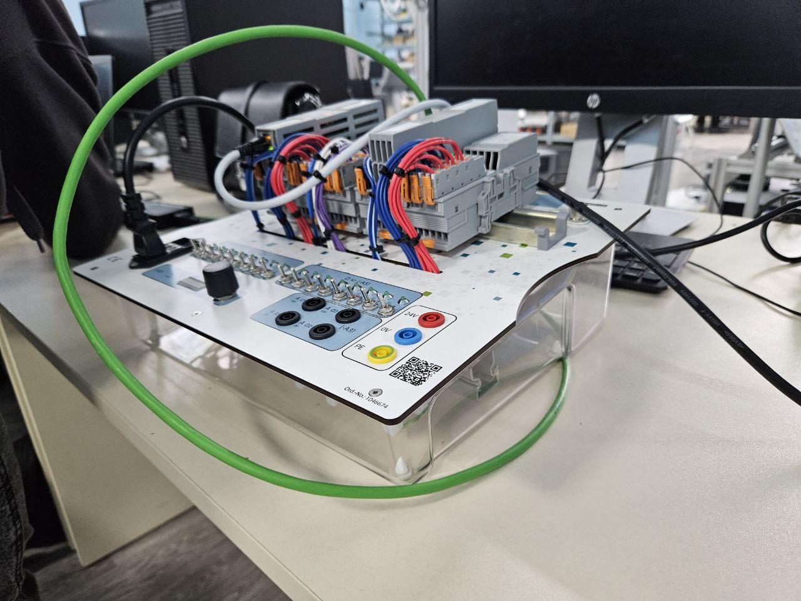
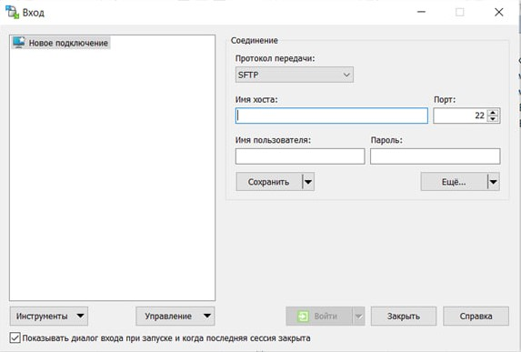
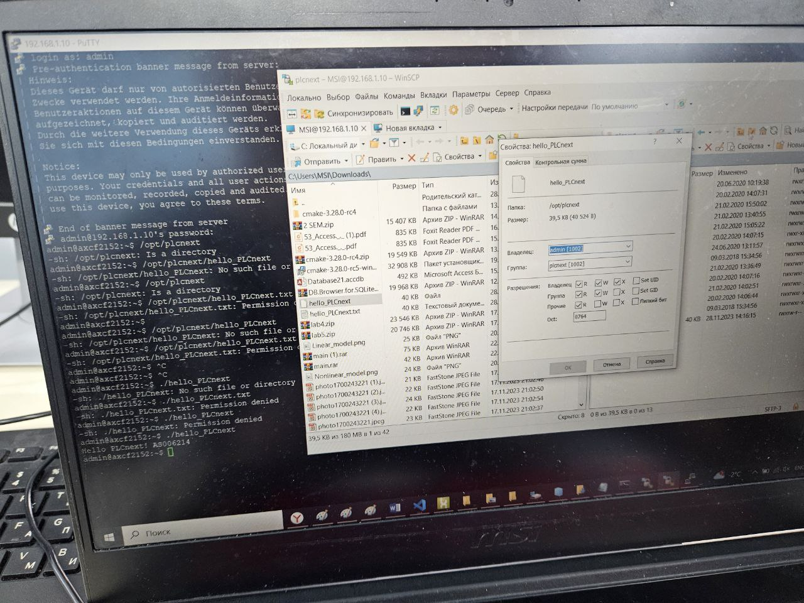
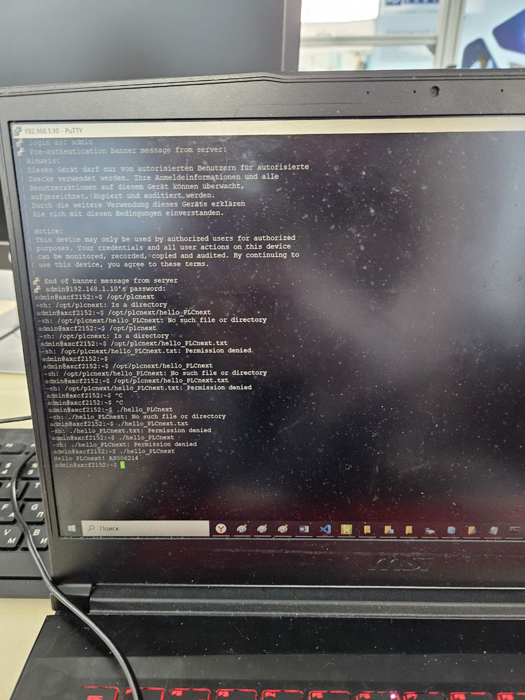

 Министерство образования Республики Беларусь

Учреждение образования

“Брестский Государственный технический университет”

Кафедра ИИТ

       

Лабораторная работа №3

По дисциплине “Теория и методы автоматического управления”

Тема: “Работа с контроллером AXC F 2152”

     

Выполнил:

Студент 3 курса

Группы АС-62

Кулик А.Д.

Проверил:

Иванюк Д. С.

     

Брест 2023

---

## Цель работы:  
Используя Visual Code спроектировать тестовый проект "Hello PLCnext from AS0xxyy!", собрать его и продемонстрировать работоспособность на тестовом контроллере.
## Ход работы
 
<li>Из нашей задачи собираем файл. Впоследствие подключимся к файлу в настройках сети. После включаем PuTTY и подключимся к контроллеру.</li>

 
<li>Открываем WinCP.</li>

 
<li>Выдаём права нашему файлу</li>

 
<li>Получим</li>

   
## Проблемы с которыми я столкнулась:
в ходе выполненной работы я столкнулась с рядом проблем, которые были решены для получения результата. такими проблемами были проблемы с пониманием технологии корректного клонирования репозитория, не понимание требуемого по для выполнения работы, проблемы с подключением контроллера, проблемы со сборкой проекта, в частности не распознаванием соманд вследствии некорректного расположения папки с симейком и описания ее расположения в системной переменной среды пас. все эти проблемы удалось решить в ходе выполнения данного задания. выполнение задания заняло в совокупности порядка 12 часов. данная лабораторная работа выполнялась командой студентов as006214,as006217 и as006219.