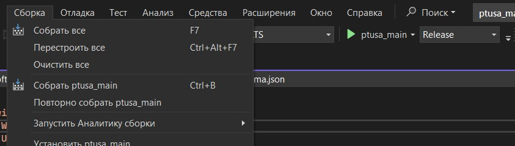
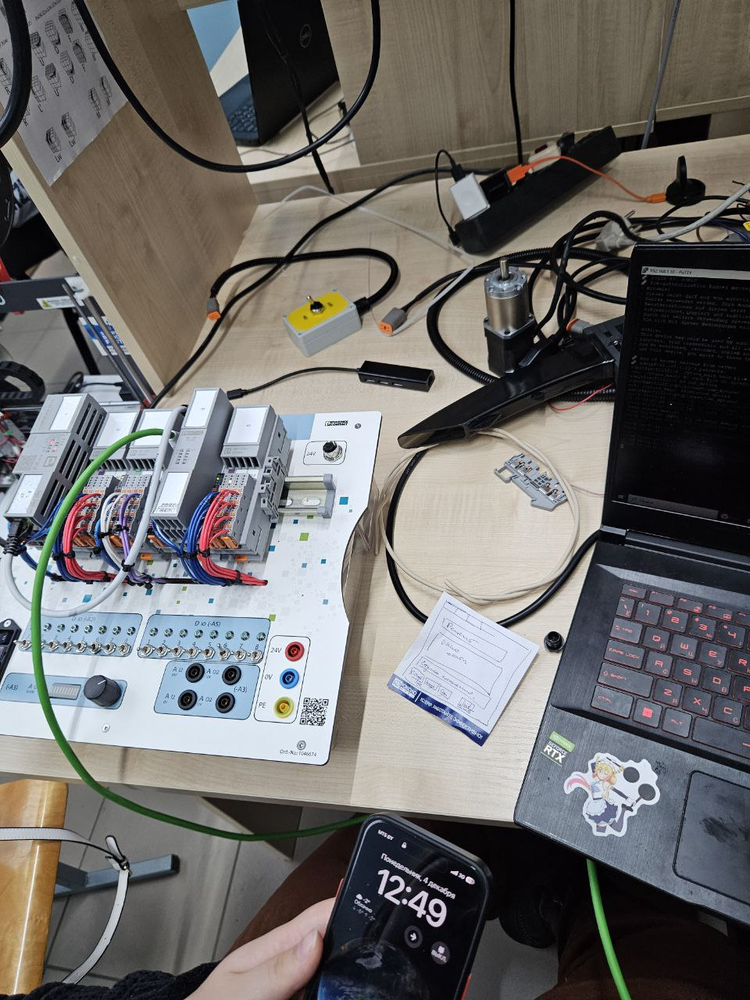
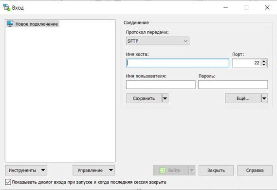
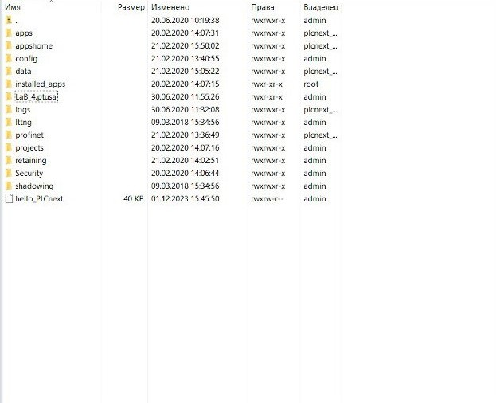
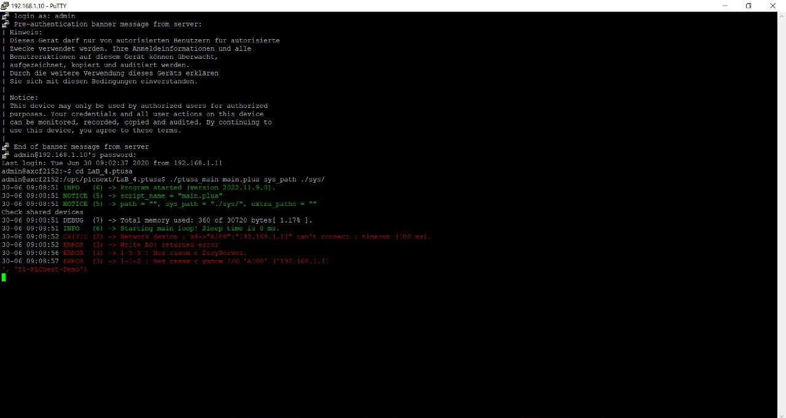
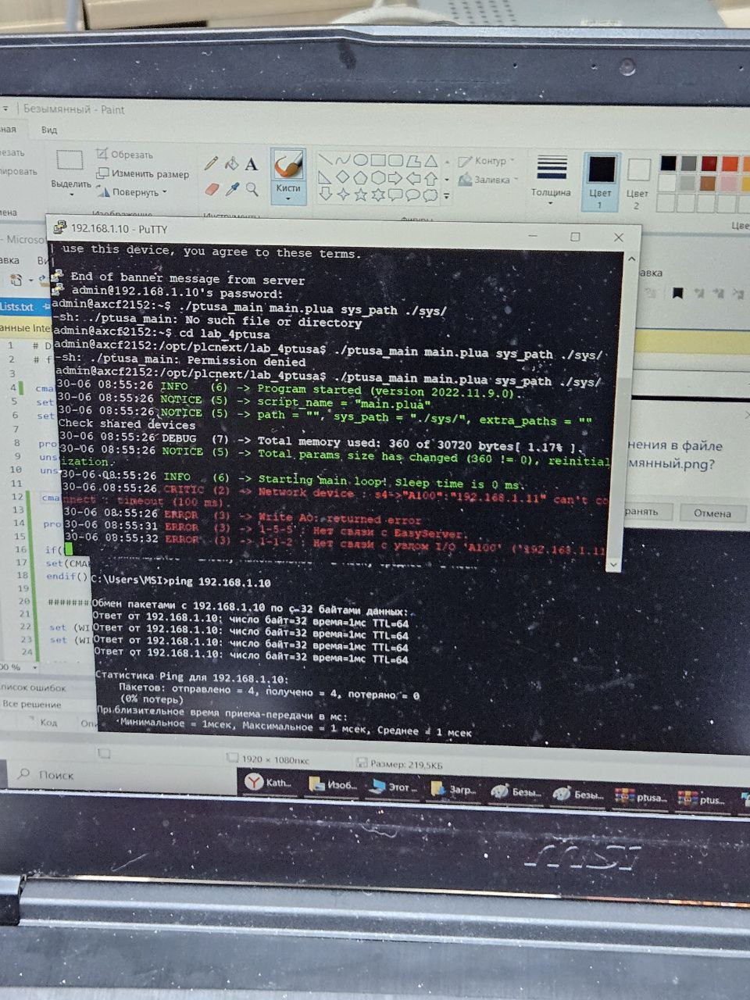
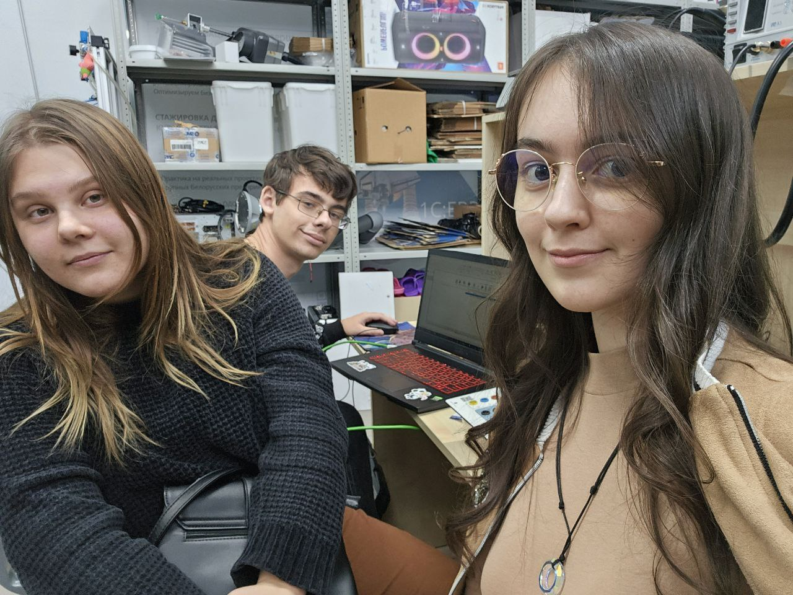

<strong>Educational institution</strong>
 

<strong>“Brest State Technical University”</strong>
 

<strong>IIT Department</strong>
 
     

<strong>Laboratory work No. 4</strong>
 

<strong>In the discipline “Theory and methods of automatic control”</strong>
 

<strong>Topic: “Working with the AXC F 2152 controller”</strong>
 
     

<strong>Made by:</strong>
 

3rd year student
 

AS-62 groups
 

Kulick A.D.

   

<strong>Checked:</strong>
 

Senior Lecturer
 

Ivanyuk D.S.
 
     

Brest 2023
 

---

<strong>Task</strong>

<li>
1. Read general information about the **PLCnext** platform [here](https://www.plcnext.help/te/About/Home.htm).</li>

<li>
2. Study the project [ptusa_main](https://github.com/savushkin-r-d/ptusa_main).</li>

<li>
3. Using **Visual Studio** collect project data and demonstrate performance on a test controller.</li>

<li>
4. Write a report on the work performed in .md format (readme.md) and use a pull request to place it in the following directory: trunk\as000xxyy\task_04\doc.</li>

 <strong>Aim: </strong>using <em>Visual Studio</em> assemble this project and demonstrate its functionality on a test controller.
 
 

 <strong>Solution:</strong> 

 
<ul>
 
<li>According to the assignment of laboratory work No. 4, we clone the repository [ptusa_main](https://github.com/savushkin-r-d/ptusa_main).</li>
 
<li>
Open total repo in the visual studio. Thus we get a project based on CMake.
</li>
 
<li>
Using Visual Studio We are assemble this project with CMake assembly tool.
</li>
 

  
<li>
Next we connect to the test controller AXC F 2152 in the laboratory.
</li>
 

  

  
<li>
We go to the folder with the project, having previously moved it to the controller, and launch our program:
</li>
 

  
<li>
For the resulting assembly file hello_PLCnext we set the access rights
</li>
 

  
<li>
Now using folowing command, we get the result: 
</li>
 
./ptusa_main  main.plua  sys_path  ./sys/
 
<li>
We get the following output from our program: 
</li>
 
</ul>
 

  

  

 Conclusion: During the course of this laboratory work, we gained valuable experience working with Visual Studio and the AXC F 2152 controller, which is an important step in acquiring programming skills and working with automated systems. Additionally, it is worth noting that such practical exercises not only reinforce theoretical knowledge but also develop the ability to solve real technical problems, which is a key aspect of engineering activities.

 

The use of the AXC F 2152 controller opens up wide possibilities for creating flexible and scalable automation systems. Thanks to its high performance and multifunctionality, we can successfully implement complex projects in the field of industrial automation. The new skills acquired in working with this controller can be applied in various projects, ranging from simple monitoring and control tasks to complex systems that require integration with other devices and services.
 

This laboratory work required significantly less time to complete compared to the previous one, taking approximately an hour or two. This laboratory work was carried out by a team of students as006214, as006219, as006217.

 

this laboratory work helped us learn to work in a team and develop more soft skills.
 

  