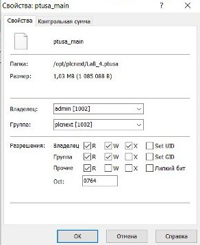

<strong>教育机构</strong>
 

<strong>“布雷斯特国立技术大学”</strong>
 

<strong>IIT学系</strong>
 

<strong>教育机构</strong>
 

<strong>“布雷斯特国立技术大学”</strong>
 

<strong>IIT学系</strong>
 
     

<strong>实验室工作No.4</strong>
 

<strong>在学科"自动控制的理论与方法"</strong>
 

<strong>主题："使用AXC F2152控制器"</strong>
 

<strong>实验室工作No.4</strong>
 

<strong>在学科"自动控制的理论与方法"</strong>
 

<strong>主题："使用AXC F2152控制器"</strong>
 
     

<strong>制造的:</strong>
 

三年级学生
 

AS-62组
 

Kulick A.D.

<strong>制造的:</strong>
 

三年级学生
 

AS-62组
 

Kulick A.D.

     检查过:</strong>
 

正教授
 

Ivanyuk D.S.
 

<strong>检查过:</strong>
 

正教授
 

Ivanyuk D.S.
 
     

布雷斯特2023
 

布雷斯特2023
 
     
---

<strong>Task</strong>

<li>
1. 阅读有关"PLCnext"平台的一般信息(https://www.plcnext.help/te/About/Home.htm).</li>

<li>
 2. 研究项目 [ptusa_main] (https://github.com/savushkin-r-d/ptusa_main).</li>
 
<li>
3. 使用"Visual Studio"从项目中收集数据并演示测试控制器上的性能。</li>
 
<li>
4. 格式写一份关于所做工作的报告。 md（readme.md ）并使用拉取请求将其放置在以下目录中: trunk \ as000xxyy \ task_04.</li>

<strong>目标: </strong>使用<em>Visual Studio</em>组装此项目并在测试控制器中演示其功能。

 

 <strong>解决方案:</strong> 

 
<ul>
 
<li>根据第4号实验室工作的分配，我们克隆了[ptusa_main]存储库(https://github.com/savushkin-r-d/ptusa_main).</li>
 
<li>
在Visual Studio中打开总存储库。 所以我们得到了一个基于CMake的项目。
</li>
 
<li>
使用Visual Studio，我们用CMake汇编工具组装了这个项目。
</li>
 

  
<li>
接下来，我们连接到实验室的AXC F2152测试控制器。
</li>
 

  

  
<li>
让我们转到文件夹与项目，以前已将其移动到控制器，并启动我们的程序:
</li>
 

  
<li>
对于生成的hello_PLCnext程序集文件，我们设置了访问权限。
</li>
 

  
<li>
现在使用以下命令，我们得到结果:
</li>
 
./ptusa_main  main.plua  sys_path  ./sys/
 
<li>
我们从我们的程序中得到以下结果:
</li>
 
</ul>
 

  

  

结论：在这个实验室工作过程中，我们获得了与Visual Studio和AXC F2152控制器一起工作的宝贵经验，这是获得编程技能和使用自动化系统的重要一步。 此外，值得注意的是，这种实践练习不仅加强了理论知识，而且还培养了解决实际技术问题的能力，这是工程活动的一个关键方面。

 

AXC F2152控制器的使用为创建灵活和可扩展的自动化系统开辟了广泛的可能性。 由于其高性能和多功能性，我们能够成功地在工业自动化领域实施复杂的项目。 通过使用该控制器获得的新技能可以应用于各种项目，这些项目具有创建灵活和可扩展的自动化系统的广泛可能性。 由于其高性能和多功能性，我们能够成功地在工业自动化领域实施复杂的项目。 通过使用该控制器获得的新技能可以应用于各种项目，从简单的监视和控制任务到需要与其他设备和服务集成的复杂系统。 它们的范围从简单的监测和控制任务到需要与其他设备和服务集成的复杂系统。

 

与前一次相比，这项实验室工作所需的时间要少得多，大约需要一两个小时。 该实验室工作由学生as006214，as006219，as006217组成的团队进行。

 

这项实验工作帮助我们学会了团队合作，培养了更多的软技能。
 

  
