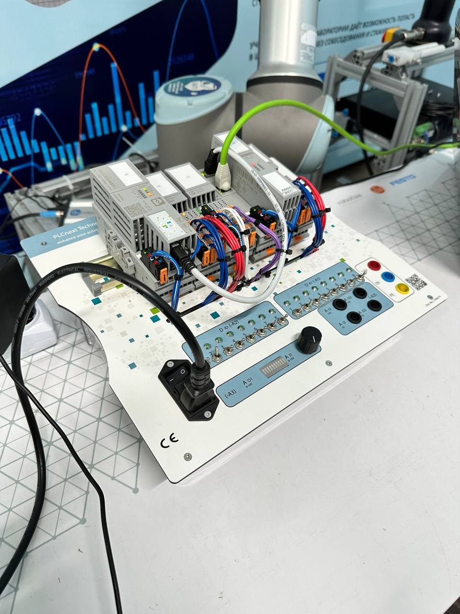
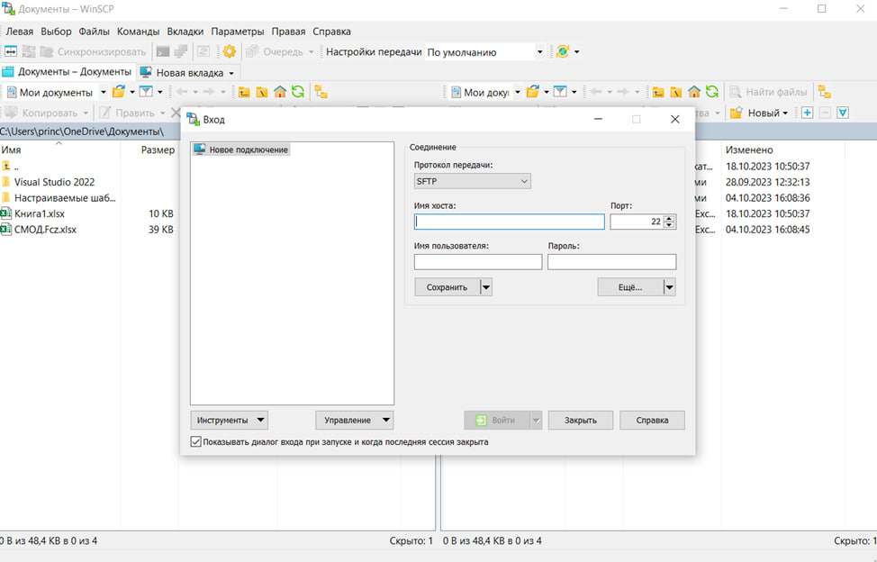
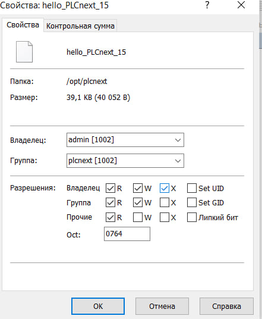
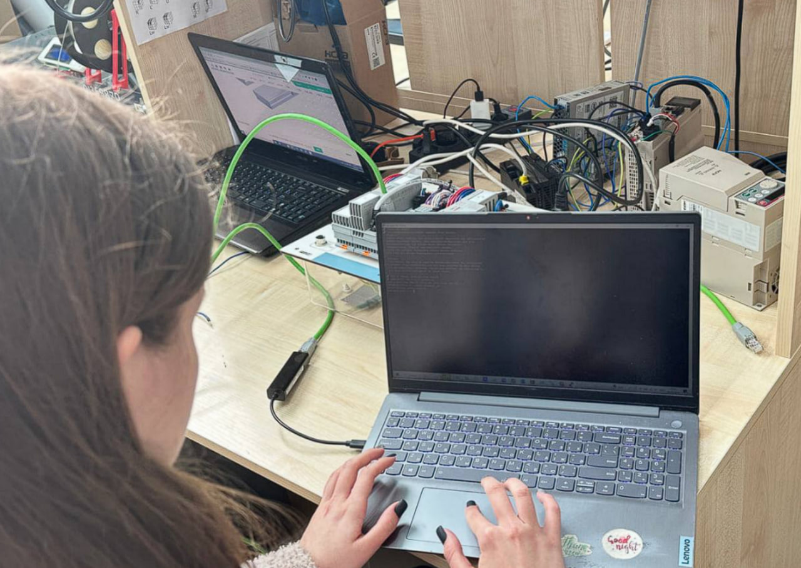
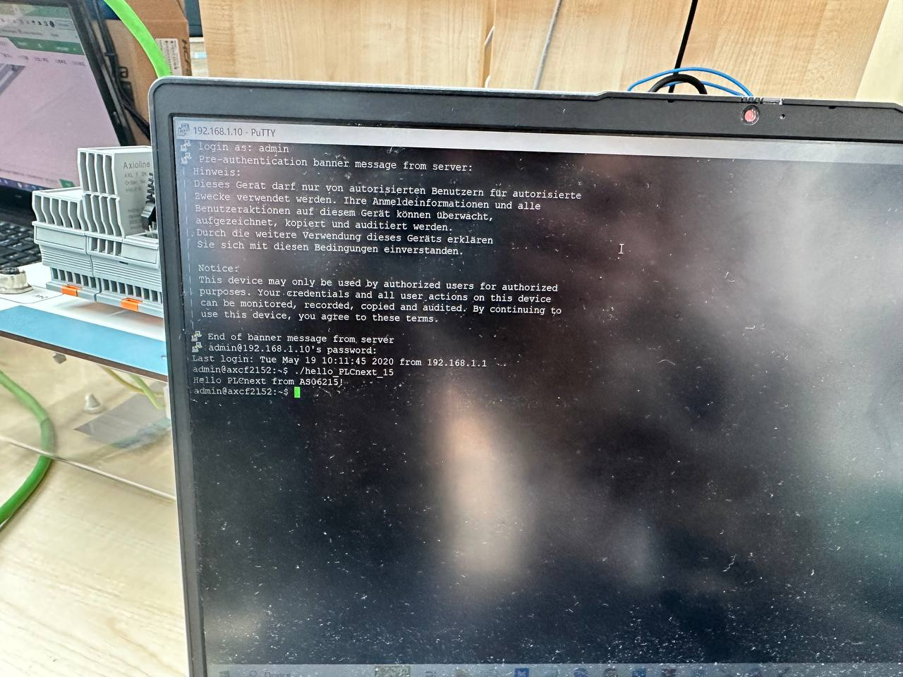

 Министерство образования Республики Беларусь

Учреждение образования

“Брестский Государственный технический университет”

Кафедра ИИТ

       

Лабораторная работа №3

По дисциплине “Теория и методы автоматического управления”

Тема: “Работа с контроллером AXC F 2152”

     

Выполнил:

Студент 3 курса

Группы АС-62

Матиевская А.В.

Проверил:

Иванюк Д. С.

     

Брест 2023

---

## Цель работы:  
Используя Visual Code создать тестовый проект "Hello PLCnext from AS0xxyy!", собрать его и продемонстрировать работоспособность на тестовом контроллере.
## Ход работы
Из условия задания собрали файл. После этого подключаемся к файлу в настройках сети.
После этого включаем PuTTY и поключаемся к контроллеру

После эого открываем WinCP.

Выдаём права нашему файлу

И запускаем программу

Результат

