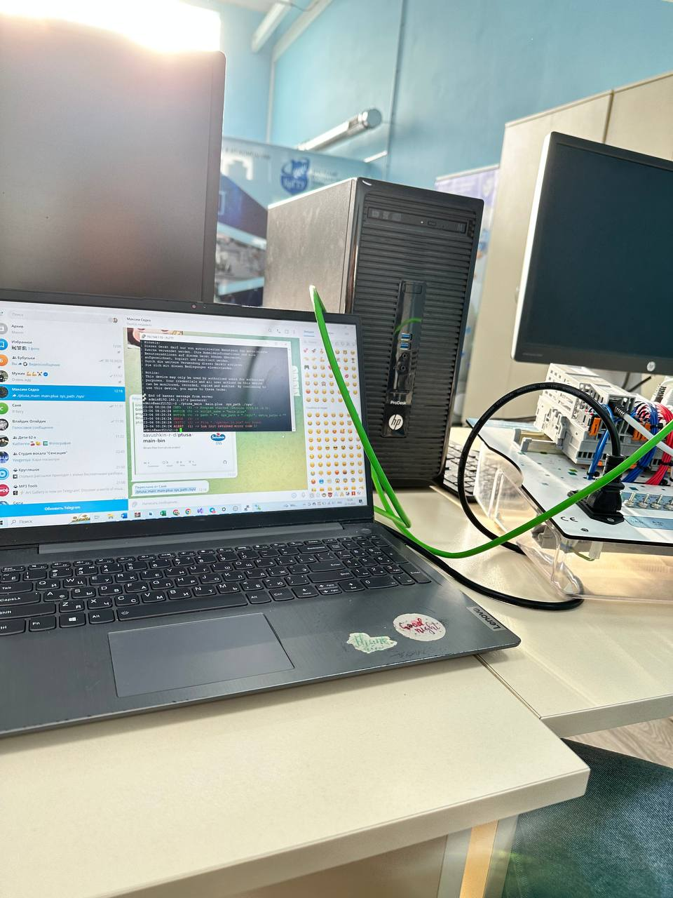
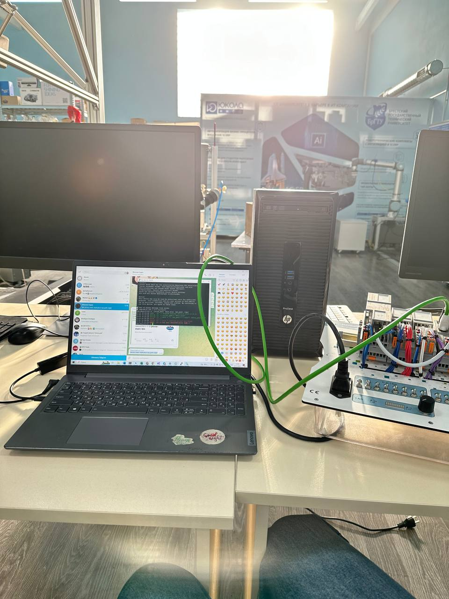

 Министерство образования Республики Беларусь

Учреждение образования

“Брестский Государственный технический университет”

Кафедра ИИТ

       

Лабораторная работа №4

По дисциплине “Теория и методы автоматического управления”

Тема: “Работа с контроллером AXC F 2152”

     

Выполнил:

Студент 3 курса

Группы АС-62

Матиевская А.В.

Проверил:

Иванюк Д. С.

     

Брест 2023

---

## Цель работы:  
Ознакомиться с общей информацией о платформе PLCnext здесь.

Изучить проект ptusa_main.

Используя Visual Studio собрать данные проект и продемонстрировать работоспособность на тестовом контроллере.

Написать отчет по выполненной работе в .md формате (readme.md) и с помощью pull request разместить его в следующем каталоге: trunk\as000xxyy\task_04\doc.
## Результаты 

Был собран проект в Visual Studio.
После чего повторно были выполнены действия как в 3 лаб.работе.<https://github.com/Asya2003/TMAU-2023/blob/main/trunk/as0006215/task_03/doc/readme.md>
Запускаем  файл с помощью команды ./ptusa_main  main.plua  sys_path ./sys/

