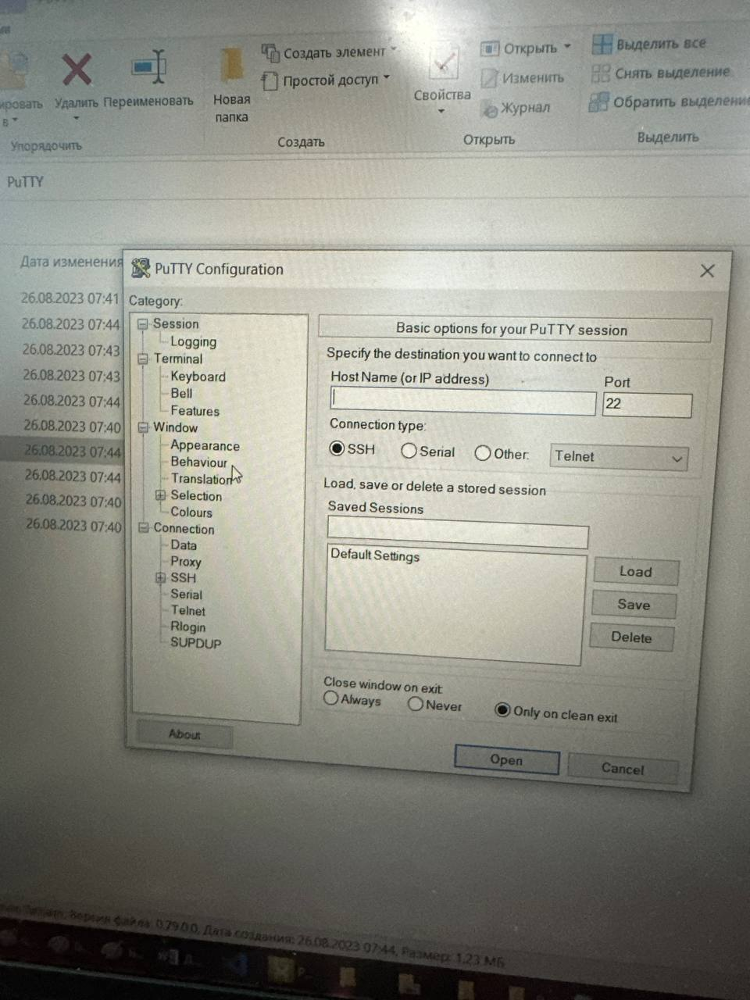

 Министерство образования Республики Беларусь

Учреждение образования

“Брестский Государственный технический университет”

Кафедра ИИТ

       

Лабораторная работа №3

По дисциплине “Теория и методы автоматического управления”

Тема: “Работа с контроллером AXCF2152”

     

Выполнила:

Студентка 3 курса

Группы АС-62

Мухачёва Е.Г.

Проверил:

Иванюк Д. С.

     

Брест 2023

---

## Цель работы:  
С помощью VisualStudioCode создать проект (тестовый) "Hello PLCnext from AS0xxyy", далее собрать данный проект и показать его работоспособность на контроллере AXC F 2152.
## Ход работы

В целях указано, что с помощью VSCode нужно создать тестовый проект и собрать его. Создаем его, собираем, получаем бинарный файл.

После получения бинарного файла нужно показать его работоспособность, а значит нужно подключить контроллер к ноутбуку. Подключаем и проверяем подключение.

Далее откроем WinSCP, авторизируемся и настроим его. Чтобы файл запускался, ему нужно выдать некоторые права. 

Далее скачаем и установим PUTTY, откроем его и настроим. 

Далее через консоль зайдем как admin, введем команды и ждем результата. 

## Какие проблемы возникли при выполнении:

По выполнении лабораторной работы, последовали следующие проблемы: подключение контроллера к ноутбуку, что решилось сменой кабеля Ethernet, установкой программы и вводом некоторых команд; Неработающий СMakе, такая проблема была решена правильным расположением фaйлов в папку PATH; права доступа - поиском нужной программы и вкладки для выдачи прав файлу; запуск файла - ввод иных команд и выдача прав файлу. 