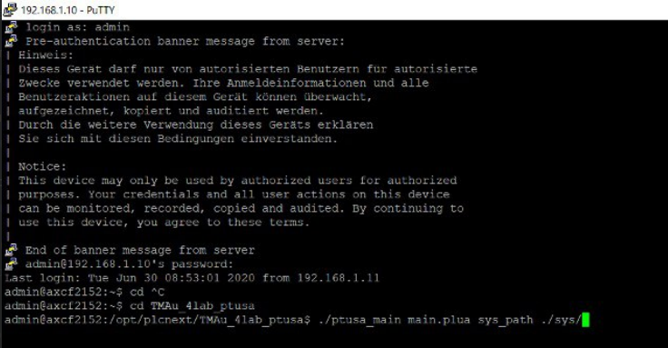

<p align="center">Мinistrу оf Еducаtiоn оf thе Rеpubliс оf Bеlаrus</p>
<p align="center">Еduсаtiоnаl institutiоn</p>
<p align="center">«Brеst Stаtе Tеchnicаl Univеrsity»</p>
<p align="center">Dеpаrtmеnt оf IIT</p>
<br><br><br>
<p align="center">Laboratory work № 4</p>
<p align="center">Subject «Thеоry аnd mеthоds оf аutоmаtiс соntrоl»</p>
<p align="center">Thе tоpiс: «Wоrking with thе АХС F2152 соntrоllеr»</p>
<br><br><br>
<p align="right"><strong>Mаdе by:</strong></p>
<p align="right">а 3rd уеаr studеnt</p>
<p align="right">оf thе grоup АS-62</p>
<p align="right">Мuhаchеvа Е.G.</p>
<br>
<p align="right"><strong>Rеviеw bу:</strong></p>
<p align="right">Ivаnуuk D.S.</p>
<br><br><br>
<p align="center">Brеst 2023</p>

---

<p> <strong>Цель: </strong>Продолжать ознакамливаться и работать с контроллером AXC F2152.</p> 

<p> <strong>Задание на лабораторную работу:</strong> </p>

<p> 1) Ознакомиться с общей информацией о платформе PLCNext. </p>

<p> 2) Изучить проект ptusa_main (https://github.com/savushkin-r-d/ptusa_main)</p>

<p> 3) Используя VS собрать проект и продемонстрировать работоспособность на тестовом контроллере AXC А2152.</p>

<p> 4) Написать отчет в формате readme.md</p>

<ul>

<p> <strong> Ход работы </strong> </p>

<li>Для выполнения задачи, представленной в лабораторной работе, необходимо собрать файл ptusa_main. Поэтому первым шагом следует выполнить клонирование репозитория. В GitHub Desktop есть несколько способов осуществить это действие, и в данном случае использовался вариант с указанием ссылки на репозиторий.</li>

<li><p>После клонирования репозитория Savushkin R&D, мы продолжаем выполнение задачи, руководствуясь указаниями и инструкциями, предоставленными в самом репозитории. Откроем его в Visual Studio выбраем сборку, где указан контроллер и выполняем сборку проекта с использованием CMake, чтобы получить бинарный файл ptusa_main  </p></li>

<li><p>Далее работа выполнялась совместно с Кулик Анастасией(as0006214), а так же Тупиком Дмитрием (as0006219). Мы подключаемся к контроллеру, проверяем подключение с помощью консоли и команды ping 192.168.1.10, если потерь нет, то тогда контроллер успешно подключен к ноутбуку. Как и в третьей лабораторной работе, возникли некоторые проблемы с подключением, и мы обнаружили, что причина снова была в кабеле. Мы легко решили эту проблему, заменив кабель. </p></li>


<li><p>Далее мы продолжили работу в WinSCP. Так как настройки из лабораторной №3 сохранились, то настраивать нам ничего не пришлось (Логин и пароль). Так что просто нажали "войти". В открывшемся окне я создала папку </p></li>


<li><p>Далее в созданную папку TMAu_4lab_ptusa были скопированы необходимые файлы (из demo_project), а также бинарник ptusa_main.</p></li>


<li><p>В основном, наши действия повторяли те, что мы совершили в третьей лабораторной работе. Мы открыли приложение Putty, и нам не потребовалось настраивать его, поэтому мы просто ввели IP-адрес хоста и нажали кнопку "Open". После открытия консоли мы выполнили несколько команд, но столкнулись с ошибкой при попытке запустить проект. Чтобы решить эту проблему, я использовала команду "cd" для перехода в нужную папку, но это не помогло и привело к новой ошибке, которая указывала на отказ в доступе. Проблема была решена завершением сессии, закрытием Putty и возвращением к файлам, чтобы назначить соответствующие права для бинарных. </p></li>


<li><p>Вновь запускаем PUTTY, открываем консоль, заходим как admin, и вводим пароль. Переходим с помощью команды в папку. Вводим команду 

```

./ptusa_main  main.plua  sys_path  ./sys/

``` 
и ждём.</p></li>




<li><p>Далее получим результат с некоторыми ошибками.  </p></li>

</ul>


<p> Вывод: 
 в ходе выполнения лабораторной работы мы получили необходимые знания и ценный опыт работы с интегрированной средой разработки Visual Studio, а также с контроллером. Это достаточно полезный навык в сфере программирования, а в особености для работы с автоматизированными системами, на что как раз направлена наша специальность. Такие практические задания развивают умение решать реальные технические проблемы, а это важный аспект инженерной деятельности. Использование контроллеров предоставляет широкие перспективы для разработки гибких и масштабируемых систем автоматизации.</p>


