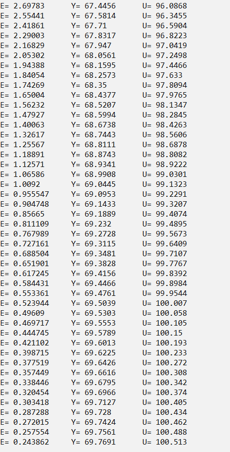
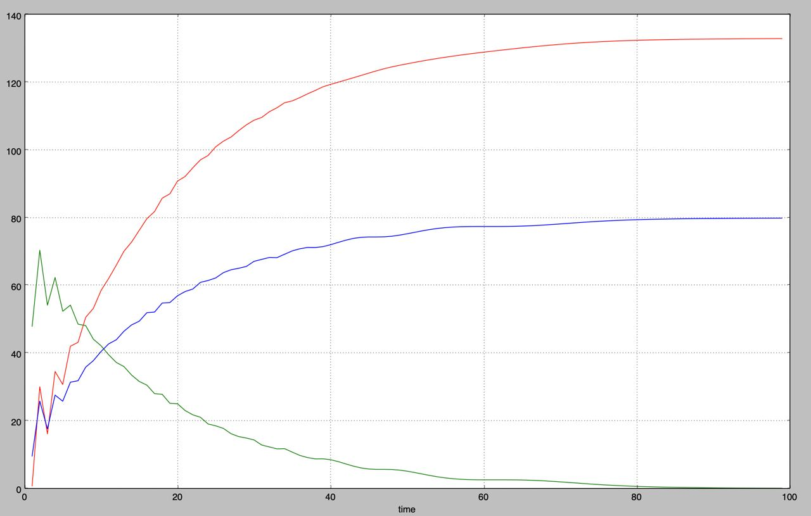

## 
Лабораторная работа №2 «Работа с ПИД-контроллером»

Выполнил: Самойлович И.С. 
Проверил: Иванюк Д.С.

***
### Цель работы
Смоделировать ПИД-Регулятор:

***

## Код программы:

Исходный код программы находящийся по пути trunk\as0006218\task_02\src.

## Результаты работы программы:

### График функции нелинейной модели:

## Вывод
Смоделировали управление температурой ПИД регулятора, написали программу, построили график нелинейного уравнения. 

