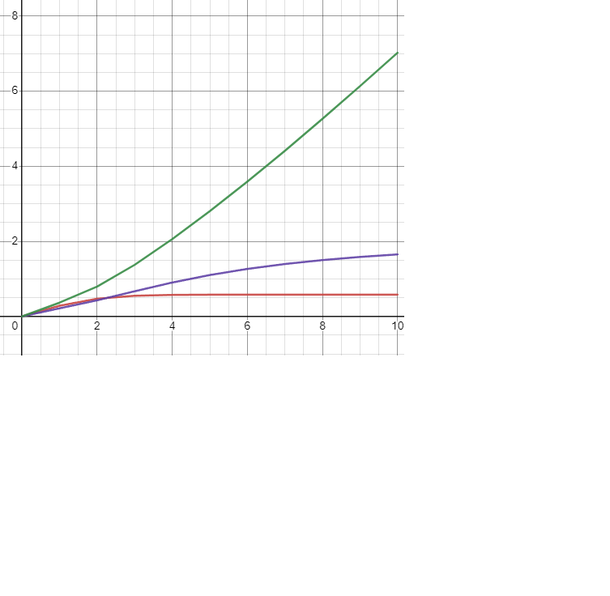

Министерство образования Республики Беларусь

Учреждение образования

“Брестский Государственный технический университет”

Кафедра ИИТ

Лабораторная работа №2

По дисциплине “Теория и методы автоматического управления”

Тема: “Изучение ПИД-регуляторов”

Выполнил:

Студент 3 курса

Группы АС-62

Тупик Д.А.

Проверил:

Иванюк Д. С.

Брест 2023

Цель работы:
Напишите программу на языке C++, которая моделирует работу ПИД-регулятора. В качестве объекта управления используйте математическую модель, которая была получилена в предыдущей работе. Реализуйте программу с использованием объектно-ориентированного подхода, включая не менее трех классов с использованием наследования. В отчете предоставить графики, демонстрирующие различные задания температуры объекта, и объяснить полученные результаты.

Ход работы: Была реализована программа на языке С++, моделирующая работу ПИД-регулятора.
Код:
#include <iostream>
#include <vector>
#include <cmath>
using namespace std;
class Math {
public:
	virtual double Calc(double currentOutput, double previousOutput, double input) const = 0;
	virtual ~Math() = default;
};
class LinModel : public Math {
private:
	double A;
	double B;
public:
	explicit LinModel(double A, double B) : A(A), B(B) {}
	double Calc(double curout, double previousOutput, double input) const override {
		return A * curout + B * input;
	}
};
class NonlinModel : public Math {
private:
	double A;
	double B;
	double C;
	double D;
public:
	NonlinModel(double A, double B, double C, double D)
		: A(A), B(B), C(C), D(D) {}
	double Calc(double current, double previous, double input) const override {
		return A * current - B * pow(previous, 2) + C * input + D * sin(input);
	}
};
class PID {
private:
	double P;
	double I;
	double D;
	double previous = 0.0;
	double integral = 0.0;
	double previousControlSignal = 0.0;
public:
	explicit PID(double P, double I, double D)
		: P(P), I(I), D(D) {}
	double calcout(double currentError) {
		integral += currentError;
		double derivativeError = currentError - previous;
		double controlSignal = P * currentError + I * integral + D * derivativeError;
		previous = currentError;
		previousControlSignal = controlSignal;
		return controlSignal;
	}
};
int main() {
	setlocale(LC_ALL, "Russian");
	double A_lin = 0.8;
	double B_lin = 0.5;
	double A_nonlin = 0.8;
	double B_nonlin = 0.5;
	double C_nonlin = 0.2;
	double D_nonlin = 0.1;
	double curoutlin = 0.0;
	double curoutnonlin = 0.0;
	double prevoutnonlin = 0.0;
	double input = 1.0;
	LinModel linModel(A_lin, B_lin);
	NonlinModel nonlinModel(A_nonlin, B_nonlin, C_nonlin, D_nonlin);
	PID pid(1.0, 0.5, 0.2);
	vector<double> curoutlinvalues;
	vector<double> curoutnonlinvalues;
	vector<double> errvalues;
	vector<double> controlsignvalues;
	for (int i = 0; i <= 9; i++) {
		curoutlin = linModel.Calc(curoutlin, 0, input);
		curoutnonlin = nonlinModel.Calc(curoutnonlin, prevoutnonlin, input);
		prevoutnonlin = curoutnonlin;
		double error = curoutlin - curoutnonlin;
		double consign = pid.calcout(error);
		curoutlinvalues.push_back(curoutlin);
		curoutnonlinvalues.push_back(curoutnonlin);
		errvalues.push_back(error);
		controlsignvalues.push_back(consign);
	}
	for (int i = 0; i <= 9; i++) {
		cout << "Итерация " << i + 1 << ":\n";
		cout << "Выход линейной модели: " << curoutlinvalues[i] << '\n';
		cout << "Выход нелинейной модели: " << curoutnonlinvalues[i] << '\n';
		cout << "Ошибка: " << errvalues[i] << '\n';
		cout << "Управляющий сигнал: " << controlsignvalues[i] << '\n';
		cout << '\n';
	}
	return 0;
}
Результаты программы:
Итерация 1:
Выход линейной модели: 0.5
Выход нелинейной модели: 0.284147
Ошибка: 0.215853
Управляющий сигнал: 0.36695

Итерация 2:
Выход линейной модели: 0.9
Выход нелинейной модели: 0.471095
Ошибка: 0.428905
Управляющий сигнал: 0.793894

Итерация 3:
Выход линейной модели: 1.22
Выход нелинейной модели: 0.550058
Ошибка: 0.669942
Управляющий сигнал: 1.3755

Итерация 4:
Выход линейной модели: 1.476
Выход нелинейной модели: 0.572912
Ошибка: 0.903088
Управляющий сигнал: 2.05861

Итерация 5:
Выход линейной модели: 1.6808
Выход нелинейной модели: 0.578363
Ошибка: 1.10244
Управляющий сигнал: 2.80242

Итерация 6:
Выход линейной модели: 1.84464
Выход нелинейной модели: 0.579586
Ошибка: 1.26505
Управляющий сигнал: 3.59022

Итерация 7:
Выход линейной модели: 1.97571
Выход нелинейной модели: 0.579856
Ошибка: 1.39586
Управляющий сигнал: 4.41258

Итерация 8:
Выход линейной модели: 2.08057
Выход нелинейной модели: 0.579915
Ошибка: 1.50065
Управляющий сигнал: 5.26251

Итерация 9:
Выход линейной модели: 2.16446
Выход нелинейной модели: 0.579928
Ошибка: 1.58453
Управляющий сигнал: 6.13446

Итерация 10:
Выход линейной модели: 2.23156
Выход нелинейной модели: 0.579931
Ошибка: 1.65163
Управляющий сигнал: 7.02403
Линейная модель:

Нелинейная модель:

Вывод: В ходе проведённой работы была разработана программа, которая моделирует работу ПИД-регулятора.