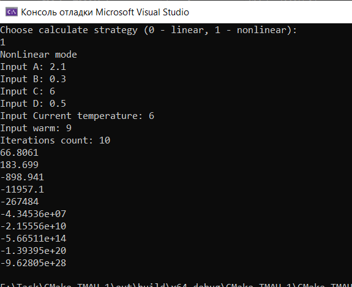

# Лабораторная работа №.1              

Министерство Образования Республики Беларусь

«Брестский Государственный Технический Университет»
       

Кафедра ИИТ

    

Лабораторная работа №.1

   

Выполнено
 

Студентом 3 Курса
 

Группы AC-62 

Проверено 
 

Иванюк Д.С.

   

Брест 2023

---

## Задание 1. 
 
Написать программу эмулирующую температуру в Линейном и Нелинейном Режимах

### Реализация
Имеются

1. КЛАСС Линейного вычисления
2. КЛАСС НеЛинейного вычисления

Результаты работы программы

