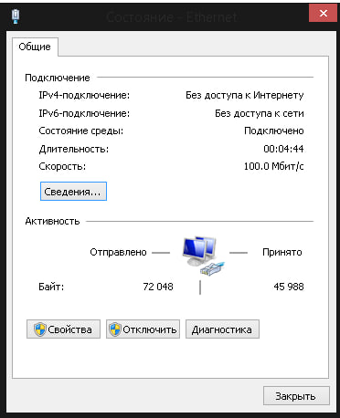
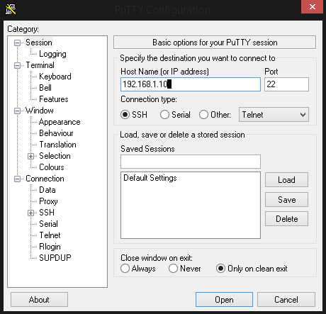
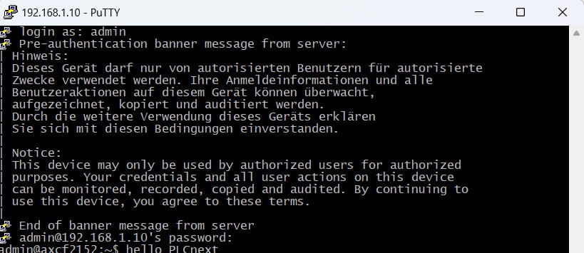
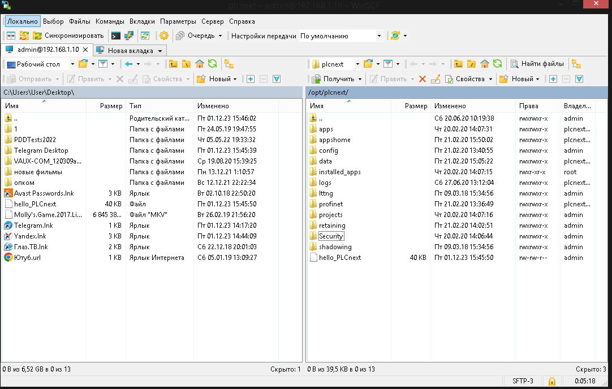
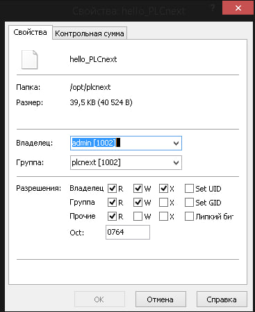
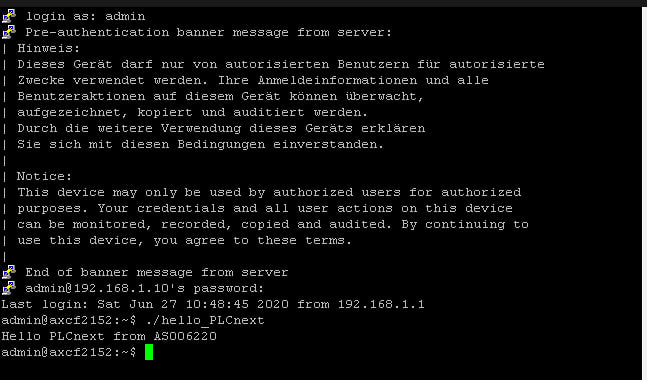
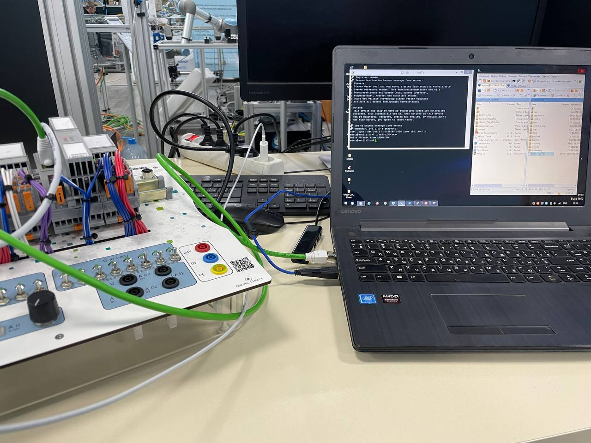

<p align="center"> Министерство образования Республики Беларусь</p>
<p align="center">Учреждение образования</p>
<p align="center">“Брестский Государственный технический университет”</p>
<p align="center">Кафедра ИИТ</p>
<br><br><br>
<p align="center">Лабораторная работа №3</p>
<p align="center">По дисциплине “Теория и методы автоматического управления”</p>
<p align="center">Тема: “Работа с контроллером AXC F 2152”</p>
<br><br><br>
<p align="right">Выполнил:</p>
<p align="right">Студент 3 курса</p>
<p align="right">Группы АС-62</p>
<p align="right">Яцина И.С.</p>
<p align="right">Проверил:</p>
<p align="right">Старший преподаватель</p>
<p align="right">Иванюк Д.С.</p>
<br><br><br>
<p align="center">Брест 2023</p>
---

<p> <strong>Цель:</strong> создать тестовый проект "Hello PLCnext from AS0xxyy!", собрать его и продемонстрировать работоспособность на тестовом контроллере.</p>

<p> <strong>Ход работы:</strong> </p>
<p>Для решения данной задачи, необходимо сначала скомпилировать файл <em>hello_PLCnext</em> в Visual Studio. Для этого используются следующие команды:</p>


 ``` bash
cmake --preset=build-windows-AXCF2152-2021.9.0.40 .
```

 ``` bash
cmake --build --preset=build-windows-AXCF2152-2021.9.0.40 --target all .
```

 ``` bash
cmake --build --preset=build-windows-AXCF2152-2021.9.0.40 --target install .
```

<p>Получаем файл <em>hello_PLCnext</em>.</p>

<p>После компиляции  исполняемого файла, устанавливаем соединения с контроллером посредством Ithernet соединение.</p>

<p align="center">

<p>Проверяем работу контроллера.</p>

<p align="center">

<p>Открываем программу <em>PuTTY Configuration</em> и устанавливаем соединения с контроллером.Затем  вводим учётные данные логин и пароль.</p>

<p align="center">
<p align="center">

<p>Затем запускаем приложения <em>WinSCP</em> и устанавливаем соеднинения с контроллером.</p>

<p align="center">

<p>Размещаем готовый проект в основной папке контроллера и изменяем его разрешения для возможности запуска.</p>

<p align="center">

<p>Мы запускаем файл для выполения и получаем результат его выполнения "Hello PLCnext from AS06220!" </p>

<p align="center">
<p align="center">