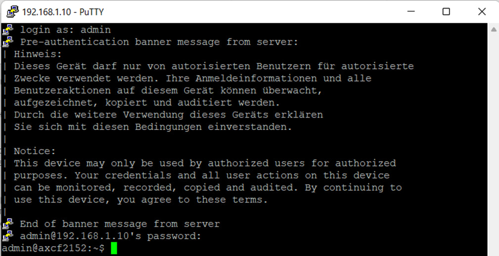

 Министерство образования Республики Беларусь

Учреждение образования

“Брестский Государственный технический университет”

Кафедра ИИТ

   

Лабораторная работа №4

По дисциплине “Теория и методы автоматического управления”

Тема: “Работа с контроллером AXC F 2152”

   

Выполнил:

Студент 3 курса

Группы АС-62

Яцина  И.С.

Проверил:

Старший преподаватель

Иванюк Д.С.

   

Брест 2023

---

 <strong>Цель:</strong> собрать его тестовый прокт ptusa_main и продемонстрировать работоспособность на тестовом контроллере.

< p > < strong >Ход работы </ strong > </ p >

Для решения поставленной задачи, для начала необходимо собрать файл <em>ptusa_main</em> в Visual Studio. Чтобы собрать файл для начала необходимо клонировать репозиторий, для этого используются следующая команда:

![ ] (../images/3.jpg )

Когда проект успешно скомпилирован в Visual Studio, следует проверить его функциональность на тестовом контроллере. Для начала необходимо настроить параметры сети Ethernet для подключения к контроллеру и подключить его к компьютеру.

Для решения поставленной задачи мы перемещаем необходимые файлы на контроллер.

![ ] ( ../images/2.png )

Чтобы решить поставленную задачу, необходимо залогиниться в путти и переместить нужные файлы на контроллер для дальнейшей работы с ними.

![ ] ( ../images/1.png )

Для решения задачи необходимо войти в Putty, переместить нужные файлы на контроллер и открыть их с помощью команды "./ptusa_main main.plua sys_path ./sys/". После выполнения команды на экране появится результат работы программы.

![ ] (../images/4.png )

Вывод: В ходе лабораторной работы мы получили ценный опыт работы с Visual Studio и контроллером AXC F 2152, что является важным шагом в приобретении навыков программирования и работы с автоматизированными системами. Дополнительно стоит отметить, что такие практические занятия не только закрепляют теоретические знания, но и развивают способность решать реальные технические задачи, что является ключевым аспектом инженерной деятельности.

