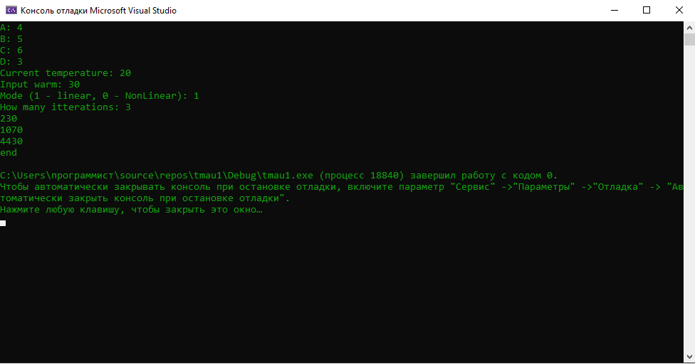
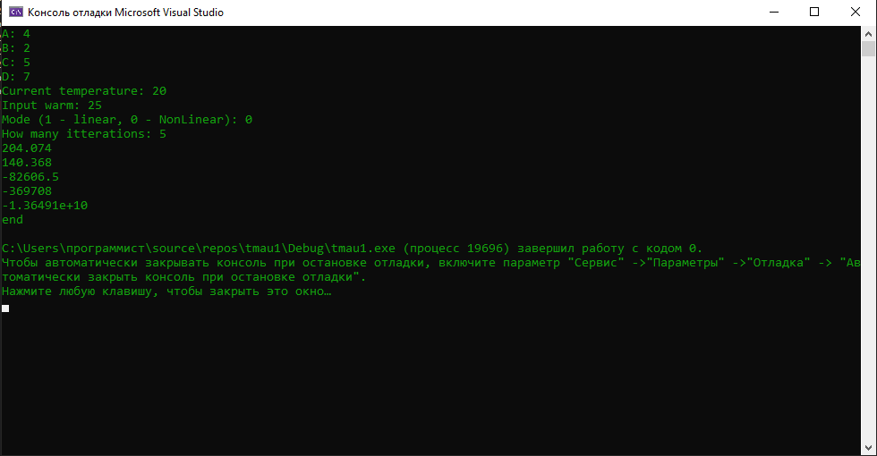

# Laboratory work №.1              

Министерство Образования Республики Беларусь

«Брестский Государственный Технический Университет»
       

Кафедра ИИТ

    

Лабораторная работа №.1

по теме:"Молделирование контролируемого объекта"

   

Выполнил
 

Студент 3 курса
 

Группы AC-62 

Шалабута Михаил

Проверено 
 

Иванюк Д.С.

   

Брест 2023

---

### Выполняемая работа 1:
 
Написать программу эмулирующую температуру в Линейном и Нелинейном Режимах

### Реализация
Имеются

1. ФУНКЦИЯ Линейного вычисления
2. ФУНКЦИЯ НеЛинейного вычисления

Результат

